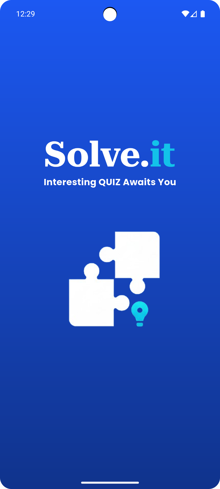
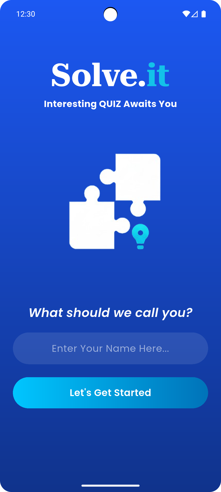
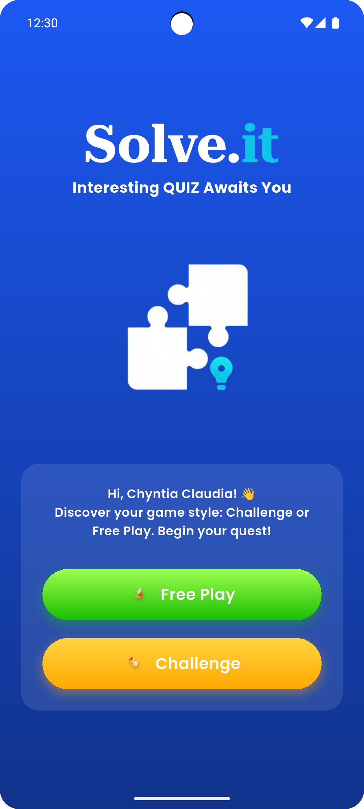
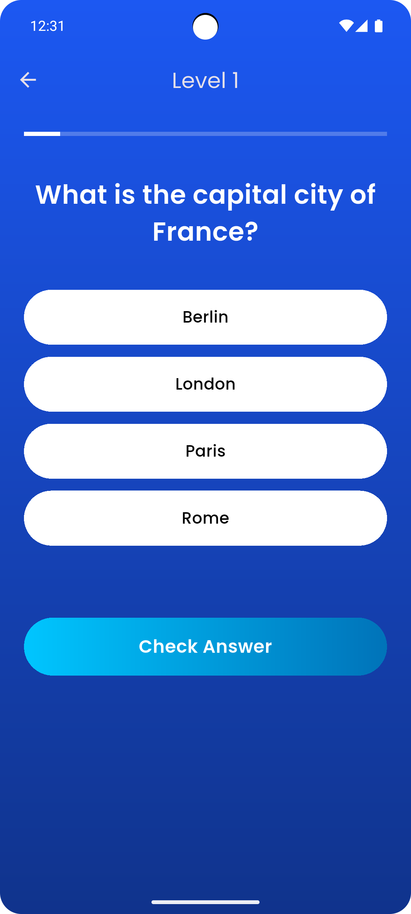
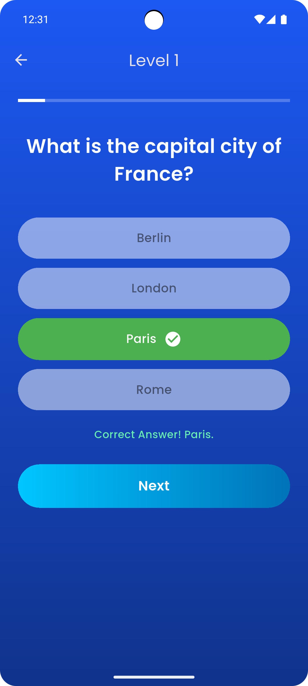
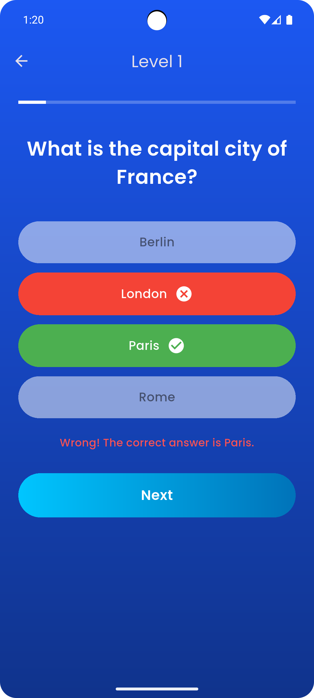
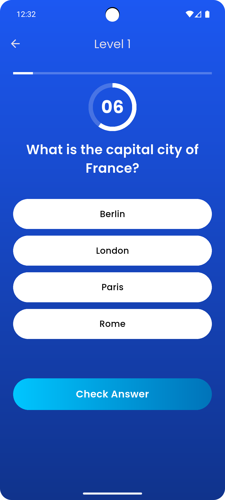
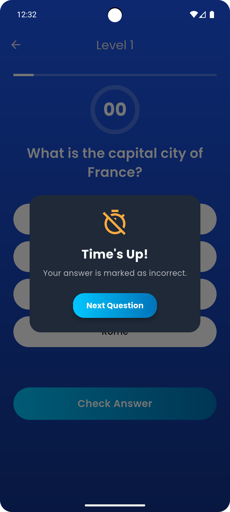
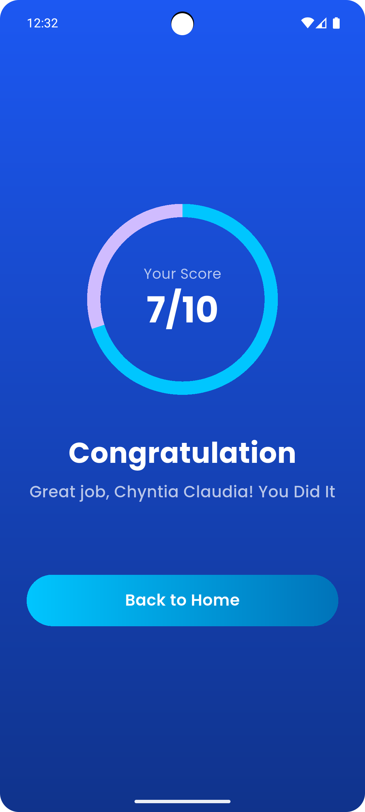

# 🧩 Solve.it

## 👤 Informasi Diri

* **Nama:** Chyntia Claudia
* **NIM:** 231401006
* **Lab:** 5

---

## 📱 Nama Aplikasi

**Solve.it** (Aplikasi Kuis Interaktif)

---

## 📝 Deskripsi Aplikasi

Solve.it adalah aplikasi kuis interaktif mobile yang dirancang untuk menguji dan memperluas pengetahuan pengguna dalam berbagai kategori.

Aplikasi ini memiliki **dua mode utama**:
1.  **Free Play:** Mode kuis santai di mana pengguna dapat menjawab 10 pertanyaan tanpa batasan waktu.
2.  **Challenge Mode:** Mode tantangan di mana setiap pertanyaan memiliki batas waktu (10 detik). Jika waktu habis, sebuah pop-up akan muncul dan jawaban otomatis dihitung salah sebelum lanjut ke pertanyaan berikutnya.

Fitur utama aplikasi mencakup navigasi antar-halaman yang mulus, *feedback* visual instan untuk jawaban yang benar/salah, dan halaman ringkasan skor yang menarik.

Aplikasi ini mencakup alur lengkap mulai dari memasukkan nama, memilih mode, menjawab kuis, hingga melihat halaman skor akhir.

---

## ✨ Tampilan Aplikasi

### Video Demo

*(Klik gambar di atas untuk melihat demo video aplikasi)*

### Screenshot

Berikut adalah tangkapan layar utama dari aplikasi Solve.it:

<table align="center">
  <tr>
    <td align="center"><strong>Splash Screen</strong></td>
    <td align="center"><strong>Welcome Screen</strong></td>
    <td align="center"><strong>Home Screen</strong></td>
  </tr>
  <tr>
    <td></td>
    <td></td>
    <td></td>
  </tr>
  <tr>
    <td align="center"><strong>Quiz (Free Play)</strong></td>
    <td align="center"><strong>Jawaban Benar</strong></td>
    <td align="center"><strong>Jawaban Salah</strong></td>
  </tr>
  <tr>
    <td></td>
    <td></td>
    <td></td>
  </tr>
    <tr>
    <td align="center"><strong>Challenge Mode</strong></td>
    <td align="center"><strong>Time's Up! Pop-up</strong></td>
    <td align="center"><strong>Score Screen</strong></td>
  </tr>
  <tr>
    <td></td>
    <td></td>
    <td></td>
  </tr>
</table>

---

## 🎨 Credit ke Sumber Aset

-   **Font Kustom: Poppins**
    -   **Sumber:** [Google Fonts](https://fonts.google.com/specimen/Poppins)

-   **Semua Ikon (Tombol Mode, dll.)**
    -   **Sumber:** [Icons8](https://icons8.com/icons) (via plugin Figma)
---

## 🔗 Link Mockup/Prototype Aplikasi

Link ke desain prototipe Figma:

[Solve.it Figma Prototype](https://www.figma.com/design/P5eVC13DzKZyJgLbF04zLv/Solve.it?node-id=0-1&t=A11ybymHzGZy01Eu-1)
